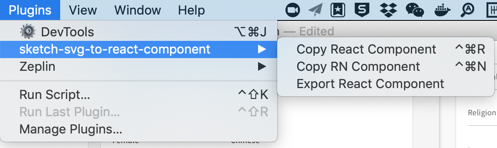

# sketch-svg-to-react-component

The sketch plugin which can transform svg to react or react native svg component. 

## Install

The most recent version you can find here: [Download the latest Sketch-Svg-to-React-Component](https://github.com/reeli/sketch-svg-to-react-component/releases)

## Usage

- Copy sketch selected layers as React Component:  `cmd + option + r`
- Copy sketch selected layers as RN Component: `cmd + option + n`
- Export multiple svg as React Component

## Upcoming soon

- Export multiple svg as RN Component

## Road Map

- Format copied string by prettier
- Remove specific characters in filename like @2x, otherwise will cause error
- Replace svgr by simplify-svg
- Add outline for svg
- Export react components with customized template

## Publish

- rm assets/node_modules before publish